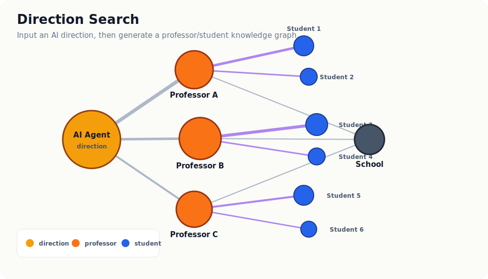
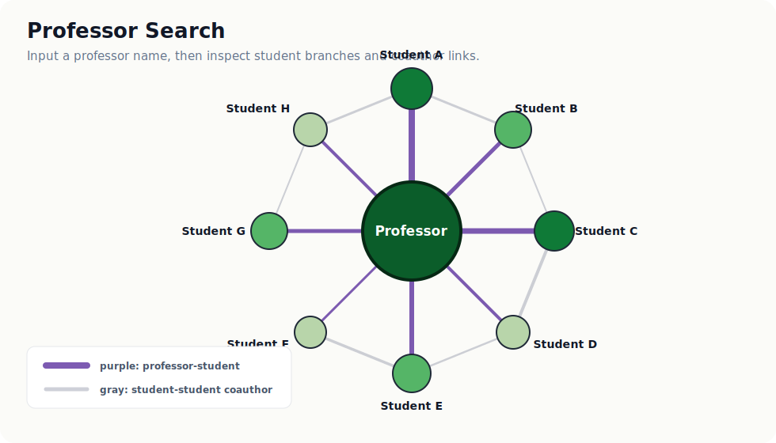

# AI Lab Angel Radar

一个用于 AI 实验室发现与关系图谱生成的开源工具。

给定一个 AI 方向，或者给定一位老师，它会从本地雷达数据库里整理出相关的老师、学生、学校、论文证据与合作关系，并生成可交互的知识图谱。

这个项目更适合做早期技术/学术/投资侦察：快速看清一个方向里有哪些实验室、哪些学生、哪些老师值得继续跟进。

## 核心能力

### 1. 按方向生成图谱

输入一个 AI 方向，比如 `Agent`、`World Model`、`VLA`、`AI Infra`、`Multimodal`、`Autonomous Driving`，工具会根据实验室关键词、论文标题、论文关键词等证据，生成一个聚焦方向图。

图里主要保留：

- 方向 -> 老师
- 老师 -> 学生
- 学校 -> 老师
- 论文作为证据文本保留，不直接变成图上的节点，避免节点爆炸

生成逻辑：

- 输入方向名和一组可选关键词。
- 在 `labs.lab_name`、`labs.pi_name`、`labs.keywords`、`papers.title`、`papers.keywords_matched`、`papers.venue` 中做匹配。
- 每个实验室会按方向证据、论文数量、引用信号和实验室分数进行排序。
- 图上只展示方向、老师、学生候选和学校/机构，论文只作为 hover 证据保存。
- 老师到学生候选的边来自本地数据库中的 `ADVISES` 推断关系。

示例：

```bash
python -m src.graph.export_direction_graph \
  --direction "Agent" \
  --keywords "AI Agent,LLM Agent,multi-agent,tool use,planning"
```



### 2. 按老师生成恒星图

输入一位老师的名字，生成以老师为中心的学生关系图。老师在中心，学生围成一圈。

图中含义：

- 绿色中心节点：老师
- 绿色深浅不同的学生节点：学生潜力分
- 紫色线：老师和学生之间的指导/合作关系
- 灰色线：学生和学生之间的共同论文关系
- 线越粗：关系或合作强度越高

生成逻辑：

- 先在本地数据库中找到指定老师对应的 PI 节点。
- 读取该 PI 指向其他人的 `ADVISES` 关系，并按置信度排序。
- `ADVISES` 关系由论文共同作者信号推断：共同论文数量、是否同机构、是否当过一作都会影响置信度。
- 如果共同作者明确来自外校，置信度会被压低，避免把外校合作者误当成学生。
- 恒星图最多展示指定数量的学生候选，默认 `16` 个。
- 紫色边的粗细综合了指导/合作置信度和共同论文数量。
- 灰色边只表示学生候选之间有共同论文，不表示师生关系。

示例：

```bash
python -m src.graph.export_pi_ego_graph --pi "Xipeng Qiu" --max-students 16
```



## 输出文件

生成结果默认写入 `data/exports/`：

- `direction_graph.html/json/graphml`
- `direction_graph_<direction>.html/json/graphml`
- `pi_ego_graph.html/json`
- `pi_ego_<teacher_name>.html/json`

其中：

- `.html` 可以直接用浏览器打开
- `.json` 方便给其他程序或 LLM 使用
- `.graphml` 方便导入 Gephi、Cytoscape 等图分析工具

`data/exports/` 默认不会上传到 GitHub，避免把本地生成数据一起公开。

## 安装

```bash
python -m venv venv && source venv/bin/activate
pip install -r requirements.txt
cp .env.example .env
```

可选环境变量：

| 变量 | 是否建议 | 说明 |
|---|---:|---|
| `OPENALEX_EMAIL` | 建议 | OpenAlex 礼貌访问邮箱 |
| `GITHUB_TOKEN` | 建议 | 用于增强 GitHub repo/project 信号 |
| `SEMANTIC_SCHOLAR_API_KEY` | 可选 | 提高 Semantic Scholar 请求额度 |
| `LLM_PROVIDER` / `LLM_MODEL` | 可选 | LLM 增强层配置，默认可用 OpenAI 风格配置 |
| `OPENAI_API_KEY` / `ANTHROPIC_API_KEY` | 可选 | 用于方向扩展、图谱审查和分析 memo |

## 数据下载与更新

这个仓库默认不包含完整本地数据。原因是 `data/radar.db`、`data/raw/` 和 `data/exports/` 里可能包含缓存的公开论文数据、推断关系、分析结果和本地生成产物，不适合直接随 GitHub 发布。

clone 仓库后，使用者需要在本地重新构建数据：

```bash
python -m src.pipeline.run_all
```

这一步会从配置好的种子实验室出发，采集公开学术数据，更新本地 SQLite 数据库，并导出基础 CSV/HTML/JSON/GraphML 结果。

如果只是想快速验证流程，可以先跑少量实验室：

```bash
python -m src.pipeline.run_all --limit-labs 2
```

如果暂时没有 GitHub Token，或者只想先更新论文和作者关系，可以跳过 GitHub 工程信号：

```bash
python -m src.pipeline.run_all --no-github
```

如果只想更新一个老师/实验室：

```bash
python -m src.pipeline.run_lab \
  --pi "Xipeng Qiu" \
  --school "Fudan University" \
  --keywords "LLM,PEFT,LoRA"
```

本地数据和产物位置：

- `data/radar.db`：本地 SQLite 工作数据库
- `data/raw/`：公开数据源缓存
- `data/exports/`：生成的 CSV、HTML、JSON、GraphML

更新数据后，可以重新生成方向图或老师恒星图：

```bash
python -m src.graph.export_direction_graph \
  --direction "Agent" \
  --keywords "AI Agent,LLM Agent,multi-agent,tool use,planning"
```

```bash
python -m src.graph.export_pi_ego_graph --pi "Xipeng Qiu" --max-students 16
```

也可以传入自己的 seed 文件：

```bash
python -m src.pipeline.run_all --seeds data/seeds/labs_seed.yaml
```

## 本地数据库

本地数据库文件是 `data/radar.db`，默认不会上传到 GitHub。初始化、更新和重新导出图谱的命令见上面的“数据下载与更新”。

## 可选 LLM 增强

项目核心流程不依赖 LLM。没有 `OPENAI_API_KEY` 或 `ANTHROPIC_API_KEY` 时，数据采集、关系推断、打分和图谱生成仍然可以正常运行。

LLM 只作为增强层使用，负责方向理解、图谱审查和结果解释，不作为底层事实来源。

### 方向关键词扩展

把自然语言方向扩展成可用于图谱搜索的关键词：

```bash
python -m src.llm.expand_direction --direction "世界模型"
```

没有 LLM key 时，可以使用内置模板：

```bash
python -m src.llm.expand_direction --direction "世界模型" --no-llm
```

### 图谱关系审查

审查图谱里的老师-学生候选关系，区分高置信推断、需要复核和可能误判：

```bash
python -m src.llm.audit_graph \
  --input data/exports/pi_ego_xipeng_qiu.json
```

无 LLM key 时会自动生成规则版审查报告，也可以显式指定：

```bash
python -m src.llm.audit_graph \
  --input data/exports/pi_ego_xipeng_qiu.json \
  --no-llm
```

### 生成分析 memo

根据方向图或老师恒星图生成中文侦察 memo：

```bash
python -m src.llm.write_memo \
  --input data/exports/direction_graph_agent.json
```

LLM 增强层的原则是：规则管线负责事实和证据，LLM 负责理解、审查和表达。对外展示前仍建议人工复核关键关系。

## 可视化面板

```bash
streamlit run app.py
```

面板里包含实验室雷达、学生雷达、repo 雷达、聚焦图谱和搜索视图。

## 本地 API

API 是可选的。它的作用是让网页、LLM Agent 或 Skill 能够用接口调用这个工具。

如果只是自己在本地生成图谱，直接用上面的命令即可，不需要启动 API。

启动方式：

```bash
uvicorn src.api:app --reload
```

主要接口：

- `POST /directions/graph/export`
- `POST /professors/{name}/ego/export`

保留了一组 World Model 相关接口作为兼容入口，但项目主线已经改成通用 AI 方向图谱工具。

## 项目结构

```text
src/
  collectors/           公共数据采集
  entity_resolution/    人名、机构、论文匹配
  classifiers/          关键词与创业信号分类
  scoring/              实验室、学生、repo 评分
  graph/                图谱构建与 HTML/JSON/GraphML 导出
  llm/                  可选 LLM 增强：方向扩展、图谱审查、memo
  services/             API/Skill 可复用服务
  pipeline/             数据流水线命令
app.py                  Streamlit 可视化面板
skills/ai-lab-radar/    仓库内置 Skill 草稿
docs/                   项目文档和演示素材
```

## 文档

- [项目现状地图](docs/PROJECT_MAP.md)
- [通用方向图谱](docs/GENERIC_DIRECTION_GRAPH.md)
- [老师恒星图](docs/PI_EGO_GRAPH.md)
- [开源前检查清单](docs/OPEN_SOURCE_CHECKLIST.md)
- [API 与 Skill 规划](docs/API_AND_SKILL_PLAN.md)

## 测试

```bash
pytest -q
```

## 数据与隐私

项目主要围绕公开数据源设计，但本地文件可能包含缓存数据、推断关系和分析状态。

不要上传：

- `.env`
- `data/radar.db`
- `data/exports/`
- `data/raw/`
- `data/processed/`

这些路径已经写入 `.gitignore`。

如果曾经把 GitHub Token、OpenAI Key 或其他密钥放进 `.env`，建议在对应平台撤销旧密钥并重新生成。

## 当前限制

- 没有 `GITHUB_TOKEN` 时，工程项目与 repo 信号会弱一些。
- 老师-学生关系来自公开论文和机构信号推断，图中的“学生”更准确地说是“学生候选/组内年轻作者候选”，需要人工复核。
- 方向搜索主要基于关键词与论文证据，适合侦察和筛选，不等同于严格学术分类。
- 目前不包含私有企业工商、融资或商业数据库。

## 后续计划

- 抽象更多方向模板与关键词扩展逻辑。
- 加强老师搜索与全图谱关系查询。
- 增加可公开的脱敏 demo 数据集。
- 增加基于证据的 LLM 自动分析 memo。
- 将 `skills/ai-lab-radar` 打包成更通用的 Codex/Claude-style Skill。
